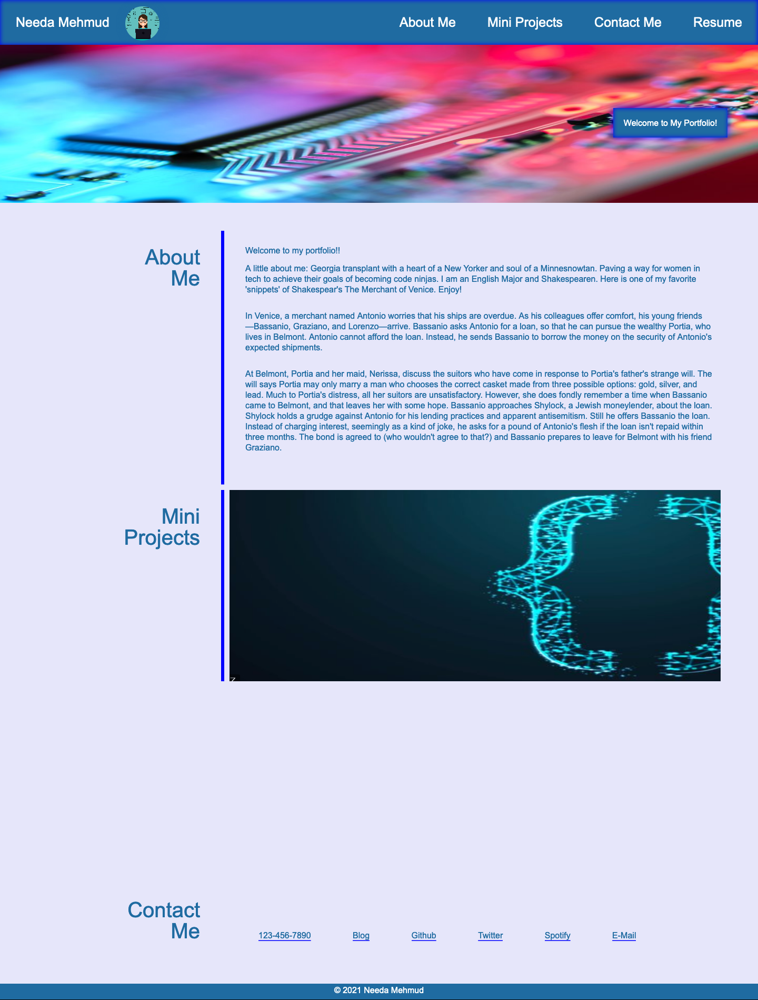

# 02 Advanced CSS: Portfolio

## Welcome to my Portfolio! 

In this assignment, I am showcasing my skills to you by highlighting what I have learned in this class. This portfolio was made with hard work, love CSS and HTML. Below is a list of Acceptance Criteria that have been met except adding more images. I did my very best to add those imges within the grid but made the page worse. Because of some mistakes that were made, I have a large white gap. I tried to remove it but was not successful.  

That being said, go ahead and check it out!

## User Story

```
AS AN employer
I WANT to view a potential employee's deployed portfolio of work samples
SO THAT I can review samples of their work and assess whether they're a good candidate for an open position
```


## Acceptance Criteria

Here are the critical requirements necessary to develop a portfolio that satisfies a typical hiring manager’s needs:

```
GIVEN I need to sample a potential employee's previous work
WHEN I load their portfolio
THEN I am presented with the developer's name, a recent photo or avatar, and links to sections about them, their work, and how to contact them
WHEN I click one of the links in the navigation
THEN the UI scrolls to the corresponding section
WHEN I click on the link to the section about their work
THEN the UI scrolls to a section with titled images of the developer's applications
WHEN I am presented with the developer's first application
THEN that application's image should be larger in size than the others
WHEN I click on the images of the applications
THEN I am taken to that deployed application
WHEN I resize the page or view the site on various screens and devices
THEN I am presented with a responsive layout that adapts to my viewport
```

## Link to github pages

 https://needamehmud2017.github.io/advanced-css-portfolio/

## Screenshot

The following screenshot is the image of the Portfolio.




